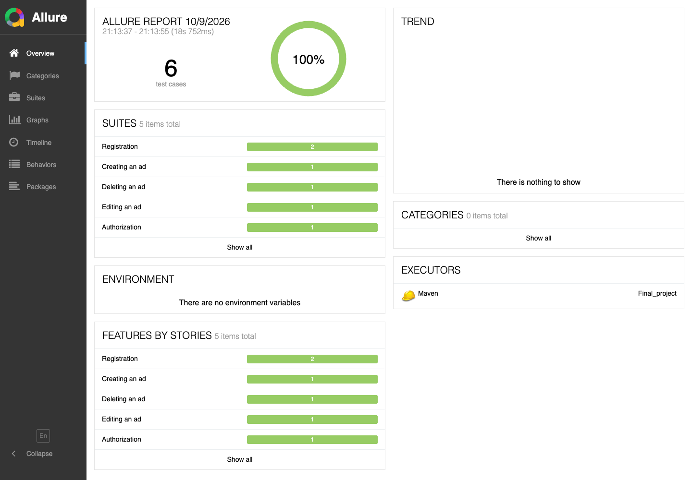
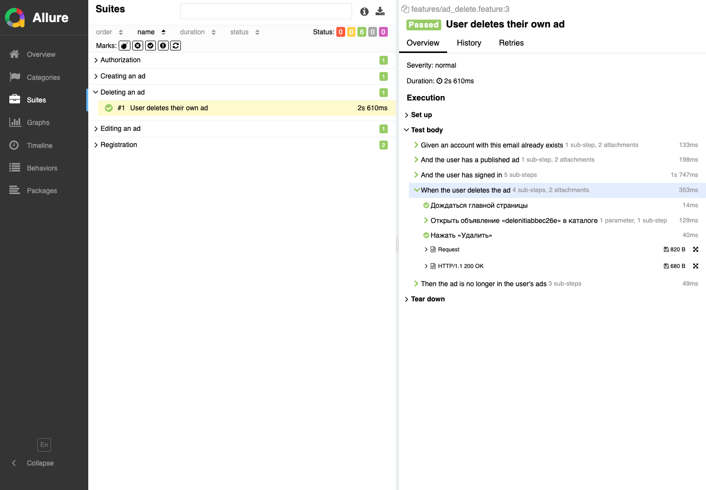

# Автотесты сервиса «Доска объявлений»

UI- и API-тесты стенда [Доска объявлений](https://qa-desk.education-services.ru/): регистрация, вход, публикация, редактирование и удаление объявления.

## Стек

| Инструмент | Версия |
| --- | --- |
| Java | 11 |
| Selenide | 6.19.1 |
| Cucumber | 7.34.9 |
| JUnit 5 | 5.14.4 |
| RestAssured | 5.5.7 |
| Allure | 2.33.0 |
| PicoContainer | 7.34.9 |
| Datafaker | 1.9.0 |
| Lombok | 1.18.48 |

Отчёт собирает плагин `allure-maven` 2.15.2 (Allure Report 2.29.0).

## Структура

```text
src/test/java/praktikum
├── api       клиенты REST: регистрация и объявления
├── config    адрес стенда и браузер
├── context   пользователь, токен и объявление одного сценария
├── data      генераторы пользователя и объявления
├── hooks     браузер перед сценарием и очистка объявления, если остались id и токен
├── models    модели User и Ad
├── pages     страницы интерфейса
├── runner    запуск Cucumber через JUnit 5
└── steps     шаги сценариев
src/test/resources
├── features                  сценарии
└── junit-platform.properties плагин Allure и PicoContainer
```

## Как запустить

Весь набор:

```bash
mvn clean test
```

Один сценарий. Значение `cucumber.filter.name` — регулярное выражение, в кавычках, если в имени есть пробелы:

```bash
mvn clean test -Dcucumber.filter.name="User deletes their own ad"
```

Открыть отчёт Allure:

```bash
mvn allure:serve
```

## Подготовка данных

Каждый сценарий работает со своим пользователем.

Если аккаунт должен уже существовать, тест создаёт его запросом `POST /api/signup` до шагов в браузере. Так устроены вход, повторная регистрация, публикация, редактирование и удаление. Публикация делает этот запрос внутри «the user has signed in», затем читает id из адреса после клика в «Мои объявления» и оставляет id и токен для `@After`. Сценарий регистрации с новым email создаёт пользователя только через форму. Под полем email стенд показывает текст «Ошибка».

Пользователей тест не удаляет: у обычного пользователя такого API нет.

Объявление для редактирования и удаления создаётся через API до шагов в интерфейсе. Сценарий удаления снимает его в UI. Сценарий публикации создаёт объявление через форму.

`@After` перед DELETE вызывает `GET /api/profile/listings/{page}`. Повторный DELETE не отправляется, если объявления уже нет. Если DELETE вернул 500, а повторная проверка профиля показывает, что объявления нет, очистка считается успешной. Если объявление всё ещё есть после зелёного сценария, хук падает; у уже красного ошибка очистки остаётся во вложении Allure и не пробрасывается. Браузер закрывается в любом случае.

## Почему удаление ищет карточку на главной (пометка для ревью)

Страница объявления не запрашивает объявление по id. Она ищет этот id только в каталоге, который главная уже загрузила (`GET /api/listings/{page}`). «Мои объявления» — другой список, и клик там меняет только адрес. Пока в этой же вкладке не загружена страница каталога с этим объявлением, кнопки «Удалить» нет: страница показывает пустое объявление и «Показать контакты продавца». Номер страницы тест берёт из `GET /api/listings/{page}`, а в интерфейсе доходит до неё правой стрелкой. Правая стрелка не нажимается, если главная уже открыта на нужной странице.

## Отчёт Allure

Прогон из 6 сценариев, все прошли.




